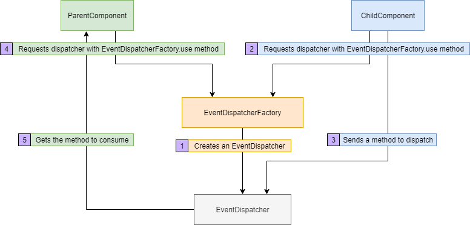

<div align="center">
	<br>
        
	<br>
</div>

<br>

[](https://www.gnu.org/licenses/gpl-3.0) [](https://badge.fury.io/js/react-event-dispatcher) [](https://codecov.io/gh/MuhammedBeraKoc/react-event-dispatcher) [](https://travis-ci.org/MuhammedBeraKoc/react-event-dispatcher) [](https://gitter.im/react-event-dispatcher/community?utm_source=badge&utm_medium=badge&utm_campaign=pr-badge)

<br>

# [Live Demo](https://codesandbox.io/s/crazy-mahavira-miooz?file=/package.json)

## What does this library offer?
- **Minimal**: It is a tiny yet crucial library for creating React apps in a much more faster and safer way.
- **Pure Abstraction**: It is so abstract that it doesn't even depend on react module. That means you can use it in any script too.
- **Fully Documented**: The project is well documented and has comprehensive unit tests.

## How to install? 📦
Since the package is in npm you can use the command below to add it to your project packages:

``` bash
npm i react-event-dispatcher
```

## How to use? 🚀
In your React file you have to import it in ES6 syntax:

``` js
import EventEmitter from 'react-event-dispatcher'
```

Now you have full access to the library. Cheers! Let's try it with a basic example:
``` js
const eventToDispatch = () => console.log('It really works 👌')
EventDispatcher.dispatch('RandomComponent', eventToDispatch)
EventDispatcher.runOne('RandomComponent')
// You should see 'It really works 👌' on your console.
```

## A Complete Example

``` js
// Written in Node
const EventDispatcherFactory = require('react-event-dispatcher')
const myDispatcher = EventDispatcherFactory.create('MyDispatcher')

class ParentComponent {
	constructor() {
		this.updateChildName = myDispatcher.getOne('$child')
	}
}

class ChildComponent {
	// Assume that this._name is private
	constructor() {
		this._name = '@ChildComponent'
		// In React you don't need to bind
		// Just create a method in Component with arrow 
		// function since it is already bound to this
		const updateName = function(name) {
			this._name = name
		}.bind(this)
		EventDispatcherFactory.use('MyDispatcher').dispatch('$child', updateName)
	}

	get name() {
		return this._name
	}
}

const childComponent = new ChildComponent()
const parentComponent = new ParentComponent()
parentComponent.updateChildName('@AwesomeComponent')
console.log({
	name: childComponent.name
})
```
``` bash
# output
{ name: '@AwesomeComponent' }
```

## Motivation and Architecture
### Motivation
I have been working on React quite lately. And one of the problems I had encountered a lot is event propagation between miscellaneous components. At some point it had been so cumbersome that I had to left some of the projects that I have been dedicated for. So I wrote this minimal yet efficient library for React.

### Architecture
Since version `1.8.0`, the main architecture has been changed drastically. The architecture schema is like below:



</br>

## Contributing
Pull requests are welcome. For major changes, please open an issue first to discuss what you would like to change. Also you can help me to improve the library by joining my [Gitter room](https://gitter.im/react-event-dispatcher/community?utm_source=share-link&utm_medium=link&utm_campaign=share-link) and sharing your ideas about it.
